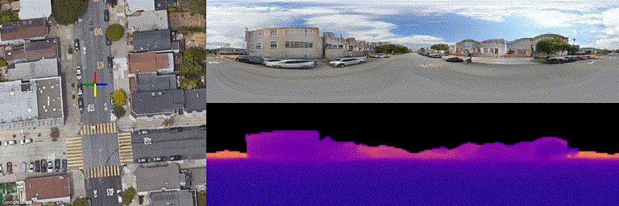

# Seeing through Satellite Images at Street Views (TPAMI 2026)

[](https://arxiv.org/abs/2505.17001)
[](https://doi.org/10.1109/TPAMI.2026.3652860)
[](https://qianmingduowan.github.io/sat2density-pp/)
[](https://huggingface.co/qian43/Sat2Densitypp)



**Demo assets**: you can download `demo_results/vigor/mesh.obj` to visualize the colored mesh locally.

**For visualization results, please see the project page.**

## 📝 About This Work

We propose **Sat2Density++**, a novel framework for high-quality street-view video synthesis from satellite imagery:

- **Minimal Training Requirements**: It only requires $N$ pairs of GPS-matched satellite and street-view panorama images. **No** video data and **no** 3D annotations are needed during training.
- **Flexible Inference**: Given a single satellite image and a user-defined driving trajectory, the model generates a temporally consistent panorama video.
- **3D Scene Reconstruction**: Given a single satellite image, it can generate a colored 3D mesh scene (rough but useful for visualization).
- **Superior Performance**: Sat2Density++ significantly outperforms the previous conference version (**Sat2Density**). Visual comparisons are available on our [Project Page](https://qianmingduowan.github.io/sat2density-pp/).

---


## 🔧 Installation

### 1. Create Environment

```bash
conda create -n sat2densitypp python=3.8
conda activate sat2densitypp
```

### 2. Install PyTorch

```bash
# Recommended: PyTorch 2.4.1
# Choose the appropriate installation command based on your CUDA version
# See: https://pytorch.org/get-started/locally/

# CUDA 12.4 example 
conda install pytorch==2.4.1 torchvision==0.19.1 torchaudio==2.4.1 pytorch-cuda=12.4 -c pytorch -c nvidia
```

### 3. Install Dependencies

```bash
pip install -r requirements.txt
```

### 4. Prepare Checkpoints

Download the pretrained weights from Hugging Face and place them in the `checkpoints/` directory:

**Pretrained weights**: https://huggingface.co/qian43/Sat2Densitypp

```
checkpoints/
├── cvact/
│   ├── generator_config.json
│   └── generator_smooth.pth
├── cvusa/
│   ├── generator_config.json
│   └── generator_smooth.pth
└── vigor/
    ├── generator_config.json
    └── generator_smooth.pth
```

---

## 🚀 Quick Start (No Download Needed!)

We provide **bundled demo data** for immediate testing:
- **CVACT**: 3 satellite images + panoramas + sky masks
- **CVUSA**: 2 satellite images + panoramas + sky masks
- **VIGOR**: 5 satellite images + panoramas + sky masks

> **Sky masks** can be obtained with any model as long as the format matches.  
> (We will release the processing code for sky mask generation later.)

### Run Demo

```bash
# CVACT dataset
bash demos/inference_demo/demo_cvact.sh 0

# CVUSA dataset
bash demos/inference_demo/demo_cvusa.sh 0

# VIGOR dataset
bash demos/inference_demo/demo_vigor.sh 0
```

where `0` is the GPU device ID.

We also provide **demo results** for quick preview:
- `demo_results/vigor/mesh.obj`: Color mesh visualization example
- `demo_results/vigor/vid.gif`: Video preview

### View Results

Generated results will be saved under:
`work_dirs/visualize_result/{satellite_image_name}/{dataset}seed{seed}/`

Typical outputs include:
- `vid.mp4`: Combined satellite + street-view video
- `vid.gif`: GIF preview
- `save_street_only_vid.mp4`: Pure street-view video
- `pred_street.png`: Street-view rendering
- `pred_satrgb.png` / `pred_satdep.png`: Satellite-view renderings
- `mesh.obj`: Extracted 3D mesh model (supports color mesh visualization)
- `save_sat/`: Rendered satellite frames

---

## 📖 Usage

### Basic Inference

```bash
python inference.py \
    --model checkpoints/s2d_vigor_combine05/checkpoint-437500.pth \
    --sat_img_path demo_data/VIGOR/satellite/satellite_41.88584553507432_-87.67181147737129.png \
    --sky_path demo_data/VIGOR/panorama/2AJ82KxYyUg0pT6dGdO7PQ,41.885744,-87.624162,.jpg \
    --position_path demo_data/VIGOR/pixels_satellite_41.88584553507432_-87.67181147737129.csv \
    --save_video True \
    --save_shape True \
    --save_sky True \
    --save_street True \
    --save_sat True \
    --seed 0
```

### Try Different Combinations

Mix and match satellite images with different sky conditions:

```bash
# List available demo images
ls demo_data/VIGOR/satellite/
ls demo_data/VIGOR/panorama/

# Run with different combination
python inference.py \
    --model checkpoints/s2d_vigor_combine05/checkpoint-437500.pth \
    --sat_img_path demo_data/VIGOR/satellite/YOUR_CHOICE.png \
    --sky_path demo_data/VIGOR/panorama/YOUR_SKY_CHOICE.jpg \
    --position_path demo_data/VIGOR/pixels_xxx.csv \
    --save_video True
```

### Create Custom Trajectory

To use your own satellite images or create new trajectories:

```bash
python make_trajectory.py \
    --input_img_path your_satellite_image.png \
    --work_dir work_dirs/visualize_result/
```

This will open an interactive window where you can draw a path on the satellite image. The trajectory will be saved as `pixels.csv`.

> **Note**: This requires a graphical interface (X11 or local display). If running on a remote server, use `ssh -X` to enable X11 forwarding.

---

## 📂 Code Structure

```
Sat2Densitypp_open/
├── inference.py              # Main inference script
├── make_trajectory.py        # Interactive trajectory creation tool
├── models/                   # Model definitions
├── utils/                    # Utility functions
├── demos/
│   └── inference_demo/       # Demo scripts
│       ├── demo_cvact.sh
│       ├── demo_cvusa.sh
│       └── demo_vigor.sh
├── demo_data/                # Bundled demo data (ready to use!)
│   ├── CVACT/
│   ├── CVUSA/
│   └── VIGOR/
├── demo_results/             # Example outputs for quick preview
├── requirements.txt          # Python dependencies
├── CHANGELOG.md              # Changes from original codebase
└── README.md                 # This file
```

See `demo_data/README.md` for detailed information about the bundled demo data.

---

## 📊 Supported Datasets
- CVACT and CVUSA are prepared in the same format as our conference version (for training).
- VIGOR is open-source. We will release the training/inference lists soon.
- Full datasets are only needed for training. For inference, you can use the bundled demo data or your own satellite/panorama images.

---

## 📜 Citation

If our work helps your research, please cite:

```bibtex
@ARTICLE{Qian_2026_Sat2Densitypp,
    author={Qian, Ming and Tan, Bin and Wang, Qiuyu and Zheng, Xianwei and Xiong, Hanjiang and Xia, Gui-Song and Shen, Yujun and Xue, Nan},
    journal={IEEE Transactions on Pattern Analysis and Machine Intelligence}, 
    title={Seeing through Satellite Images at Street Views}, 
    year={2026},
    volume={},
    number={},
    pages={1-18},
    doi={10.1109/TPAMI.2026.3652860}
}

@InProceedings{Qian_2023_Sat2Density,
    author    = {Qian, Ming and Xiong, Jincheng and Xia, Gui-Song and Xue, Nan},
    title     = {Sat2Density: Faithful Density Learning from Satellite-Ground Image Pairs},
    booktitle = {Proceedings of the IEEE/CVF International Conference on Computer Vision (ICCV)},
    month     = {October},
    year      = {2023},
    pages     = {3683-3692}
}
```

---

## 📧 Contact

We welcome any questions, discussions, or feedback:

- 📝 **Issues**: Please submit issues on this repository
- 🌐 **Project Page**: https://qianmingduowan.github.io/sat2density-pp/

---

## 📄 License

This project is released under the MIT License. See [LICENSE](LICENSE) file for details.

---

## 🙏 Acknowledgements

This work is built upon the following excellent open-source projects:

- [EG3D](https://github.com/NVlabs/eg3d) - 3D-aware generative models
- [StyleGAN2](https://github.com/NVlabs/stylegan2) - High-quality image generation
- [PyTorch](https://pytorch.org/) - Deep learning framework
- [CARVER](https://github.com/qiuyu96/Carver) - framework

Thanks to all researchers and developers who contributed to this project!

Thanks to Zifan Shi, Xingxing Weng, and Chao Pang for their fruitful discussions.

---
## ⭐ If you find this helpful, please give us a Star!

If this project helps your research or work, please:
- ⭐ **Star** this repository to support our work
- 📝 **Cite** our paper (see Citation section below)
- 🔗 **Share** with researchers who might be interested

Your support motivates us to keep improving! 🚀

---
## 📰 Updates

- **[ICLR 2026] Sat3DGen accepted**: Our new work can generate higher-quality 3D representations from reference single satellite image input  and supports more downstream applications. Code will be released soon. Code will be released on: https://github.com/qianmingduowan/Sat3DGen

---

## ✅ TODO

- Release data splits and sky masks
- Release Gradio demo
- Release training code

